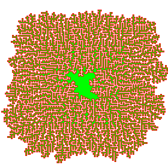

# Advent of Code 2023

My advent of code 2023 solutions written in Golang.  I stopped around day 16 due to the holidays.

## Usage

```
./go run main.go -day=<day>
```

## Other

Day 10 visualized =)


